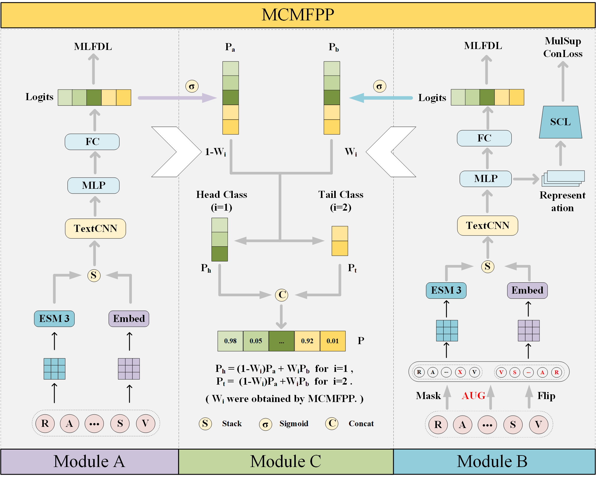
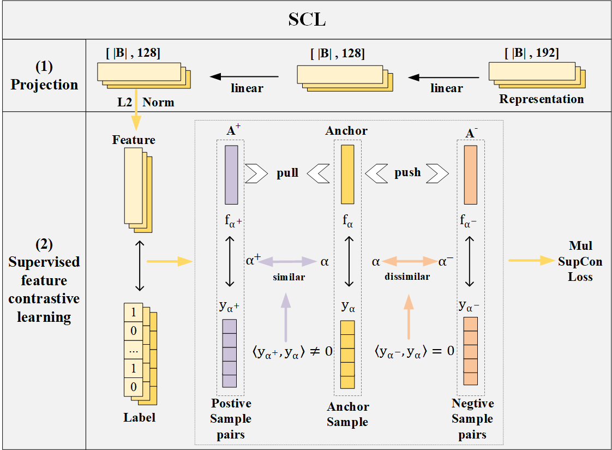
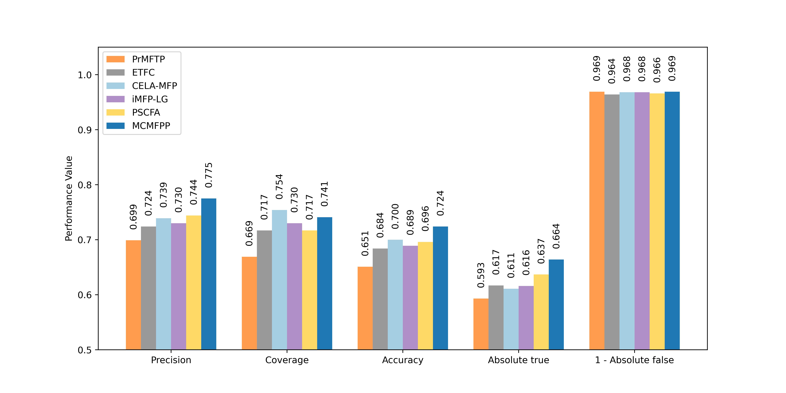

# MCMFPP  
The code for our paper "MCMFPP: A Multi-Functional Peptides Prediction Method Based on Class Feature Enhancement and Classifier Fusion”.   

## Introduction
In this paper, we develop a classification method based on weighted fusion of multiple classifiers (MCMFPP), which can efficiently and accurately predict peptide functions. Firstly, to address the issue of insufficient feature extraction for single-function peptides, we augment single-function peptide data through masking and flipping operations, combined with multi-label supervised contrastive learning to enhance class feature representation. Secondly, to tackle the poor prediction performance for tail classes, we incorporate pre-trained embeddings from large language models to improve the classification performance of tail classes. Lastly, by fusing the weighted predictions of the sub-classifiers SLFE and CFEC, MCMFPP overcome the limitations of single-classifier approaches, enabling more accurate prediction of challenging samples. 

The framework of the ETFC method for MFTP prediction is described as follows:

The supervised contrastive learning (SCL)  framework for knowledge distillation is exhibited as follows:


## Related Files
### MCMFPP

| FILE NAME         | DESCRIPTION                                      |
|:------------------|:-------------------------------------------------|
| preprocess.py     | Data preprocessing, encoding, and loading        |
| models.py         | models related to MCMFPP                         |
| train_slfe.py     | Training of the Sub-classifier SLFE              |
| train_cfec.py     | Training of the Sub-classifier CFEC              |
| predict_MCMFPP.py | Prediction with the Fusion Classifier MCMFPP     |
| estimate.py       | evaluation metrics for prediction                |
| utils.py          | Some functions that will be used during training |
| Figures           | figures                                          |
| MFTP              | dataset                                          |
| save              | Save model weights and predictions               |
| T-SNE             | T-SNE visualization                              |
| Statistical_test  | Contains related statistical tests               |
| requirements.txt  | Required packages for the environment            |

## Requirements
Please make sure your terminal is functioning properly. 

If you are using PyCharm, you can follow the steps below:
```
Open PyCharm and go to the File menu, then select Settings.
In the settings window, navigate to Tools > Terminal.
In the Shell path field, specify a shell application, such as cmd.exe.
Click Apply and OK to save the settings.
```
After setting up the terminal in PyCharm, you can simply click the green run button to execute commands.

If you are using cmd, you can manually copy the command and paste it into the cmd window to execute the task.

You can move or rename it as needed for convenience.


In order to ensure accurate reproducibility of our experiments, it is recommended that you install all the required packages listed in the requirements.txt file with a single command. Run the following in your terminal:
```bash
conda create -n mcmfpp python==3.10.16
```
```bash
activate mcmfpp
```
```bash
pip install torch==2.5.1 torchvision==0.20.1 torchaudio==2.5.1 --index-url https://download.pytorch.org/whl/cu124
```
```bash
pip install -r requirements.txt -i https://pypi.tuna.tsinghua.edu.cn/simple
```
Alternatively, you can install each package individually with the specified versions by running the following commands:
```bash
pip install esm==3.1.2 -i https://pypi.tuna.tsinghua.edu.cn/simple  
```
```bash
pip install scikit-learn==1.6.0 -i https://pypi.tuna.tsinghua.edu.cn/simple  
```
```bash
pip install numpy==1.26.4 -i https://pypi.tuna.tsinghua.edu.cn/simple  
```
```bash
pip install matplotlib==3.10.0 -i https://pypi.tuna.tsinghua.edu.cn/simple
```
```
For more information about esm, please visit the website: 
https://github.com/evolutionaryscale/esm.
```
## Reproducibility   
You can obtain the weights for the sub-classifiers SLFE and CFEC models via Baidu Netdisk at the following link:
[Baidu Netdisk Link](https://pan.baidu.com/s/1-dMiKYdjLaAlw6vL3qElYQ?pwd=0000)

After downloading and extracting the files, please place the extracted save folder inside the MCMFPP directory.

Important Note on Extracting Files:Some provided .zip or .rar archives were created by directly compressing folders.
As a result, after extraction, you may find a nested structure like:
```
FolderName/
└── FolderName/
    └── (actual contents)
```
In such cases, please use the inner folder (the second FolderName) as the working directory.

Change the directory to MCMFPP-main using the cd command, or use the absolute path of MCMFPP-main.
```
cd MCMFPP-main
```


Our experiments are conducted on an NVIDIA GeForce RTX 4060. If your GPU version is different, please directly load the model in the save directory for prediction.
```bash
python predict_MCMFPP.py
```
If you encounter network restrictions preventing access to the ESMC model on Hugging Face, we provide a mirrored copy via Baidu Netdisk:
[Baidu Netdisk Link](https://pan.baidu.com/s/1tineNNuJFKgYSWUIxT3l5A?pwd=0000)

Please extract the archive and manually place the resulting folder into the following directory (replace your-username with your actual Windows username):
```
C:\Users\your-username\.cache\huggingface\hub\
```
Note: This is the default cache directory used by Hugging Face Transformers on Windows systems.
If the directory does not exist, you can create it manually.
Then re-run the command:

```bash
python predict_MCMFPP.py
```

Plot comparison charts based on the results.
```bash
python plot1.py
```
```bash
python plot2.py
```

If your GPU version is NVIDIA GeForce RTX 4060. To ensure the code runs correctly, please activate the installed mcmfpp environment and navigate to the current directory. Follow the instructions below to train the sub-classifiers (SLFE and CFEC). Once training is complete, their model weights will be automatically saved to the save folder. You can then load the MCMFPP model to perform predictions.
```bash
activate mcmfpp
```
### Training the Sub-classifier SLFE
```bash
python train_slfe.py
```

### Training the Sub-classifier CFEC
```bash
python train_cfec.py
```

### Prediction for MCMFPP
```bash
python predict_MCMFPP.py
```

### MCMFPP outperforms the state-of-the-art methods  


### The statistical test of MCMFPP
We conducted comparative experiments on both the training set and the test set. The experimental results demonstrate that our proposed method MCMFPP significantly outperforms the existing methods.
The data and code for the comparative experiments are provided in the Baidu Netdisk link:
[Baidu Netdisk Link](https://pan.baidu.com/s/1dze2jt-xLx1vYCJ7O9i-IA?pwd=0000)

After downloading and extracting the archive, please place the folder named "Statistical_test" into the MCMFPP-main directory.

For instructions on reproducing the comparative experiments, please refer to README_Statistical_tests.md.


### Web server
The web server for multi-functional peptide prediction is openly accessible at:
[MCMFPP Web Server](https://modelscope.cn/studios/zztzjt/mcmfpp-web).
