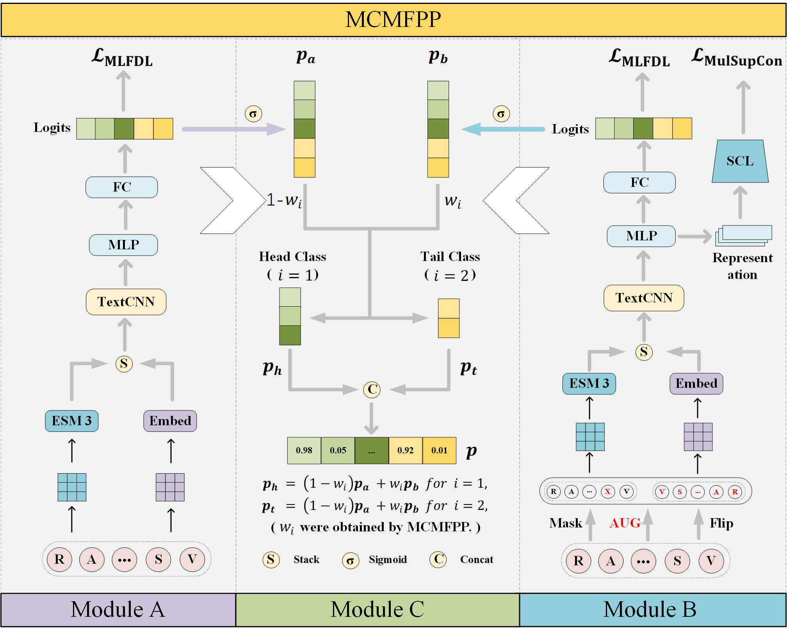
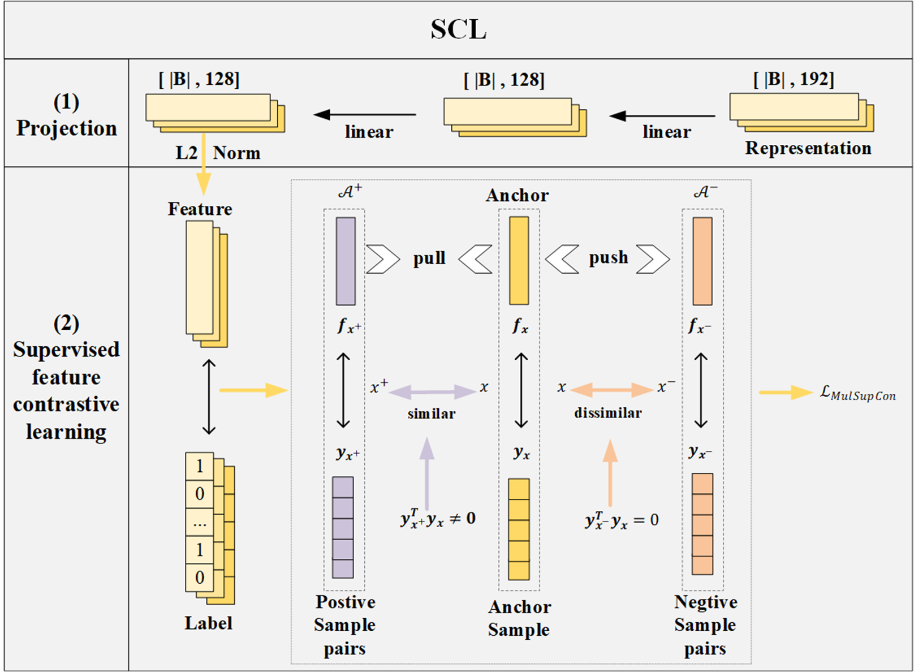

# MCMFPP  
The code for our paper "MCMFPP: A Multi-Functional Peptides Prediction Method Based on Class Feature Enhancement and Classifier Fusion”.   

## Introduction
In this paper, we develop a classification method based on weighted fusion of multiple classifiers (MCMFPP), which can efficiently and accurately predict peptide functions. Firstly, to address the issue of insufficient feature extraction for single-function peptides, we augment single-function peptide data through masking and flipping operations, combined with multi-label supervised contrastive learning to enhance class feature representation. Secondly, to tackle the poor prediction performance for tail classes, we incorporate pre-trained embeddings from large language models to improve the classification performance of tail classes. Lastly, by fusing the weighted predictions of the sub-classifiers SLFE and CFEC, MCMFPP overcome the limitations of single-classifier approaches, enabling more accurate prediction of challenging samples. 

The framework of the ETFC method for MFTP prediction is described as follows:

The supervised contrastive learning (SCL)  framework for knowledge distillation is exhibited as follows:


## Related Files
### MCMFPP

| FILE NAME           | DESCRIPTION                                           |
|:--------------------|:------------------------------------------------------|
| preprocess.py       | Data preprocessing, encoding, and loading             |
| models.py           | the main file of knowledge distillation               |
| train_slfe.py       | Training of the Sub-classifier SLFE                   |
| train_cfec.py       | Training of the Sub-classifier CFEC                   |
| predict_MCMFPP.py   | Prediction with the Fusion Classifier MCMFPP          |
| estimate.py         | evaluation metrics for prediction                     |
| utils.py            | Some functions that will be used during training      |
| Figures             | figures                                               |
| MFTP                | dataset                                               |
| save                | Save model weights and images                         |
| T-SNE               | T-SNE visualization                                   |
| requirements.txt    | Required packages for the environment                 |

## Requirements  
In order to ensure accurate reproducibility of our experiments, it is recommended that you install all the required packages listed in the requirements.txt file with a single command. Run the following in your terminal:
```bash
conda create -n mcmfpp python==3.10.16
```
```bash
activate mcmfpp
```
```bash
#The installation of CUDA
pip install torch==2.5.1 torchvision==0.20.1 torchaudio==2.5.1 --index-url https://download.pytorch.org/whl/cu124
```
```bash
pip install -r requirements.txt
```
Alternatively, you can install each package individually with the specified versions by running the following commands:
```bash
pip install esm==3.1.2  
pip install scikit-learn==1.6.0  
pip install numpy==1.26.4  
pip install matplotlib==3.10.0  
```
```
For more information about esm, please visit the website: 
https://github.com/evolutionaryscale/esm.
```
## Reproducibility   
You can obtain the weights for the sub-classifiers SLFE and CFEC models via Baidu Netdisk at the following link:

```
链接: https://pan.baidu.com/s/1IDo9klcgxU2GdjIG4Nr8fQ?pwd=fcd4 提取码: fcd4 
```
After downloading and extracting the files, please place the extracted save folder inside the MCMFPP directory.

Our experiments are conducted on an NVIDIA GeForce RTX 4060. If your GPU version is different, please directly load the model in the save directory for prediction.
```bash
python predict_MCMFPP.py
```
If your GPU version is NVIDIA GeForce RTX 4060. To ensure the code runs correctly, please activate the installed mcmfpp environment and navigate to the current directory. Follow the instructions below to train the sub-classifiers (SLFE and CFEC). Once training is complete, their model weights will be automatically saved to the save folder. You can then load the MCMFPP model to perform predictions.
```bash
activate mcmfpp
```
### Training the Sub-classifier SLFE
```bash
python train_slfe.py
```

### Training the Sub-classifier CFEC
```bash
python train_cfec.py
```

### Prediction for MCMFPP
```bash
python predict_MCMFPP.py
```

### MCMFPP outperforms the state-of-the-art methods  


### Web server
```
The web server for multi-functional peptide prediction is openly accessible at:
https://huggingface.co/spaces/zzt11w/MCMFPP.
The web interface is as follows:
```
